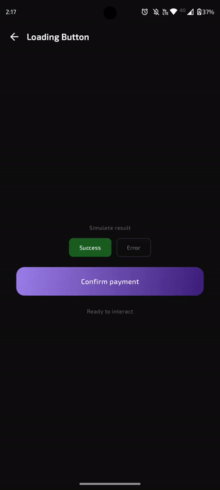
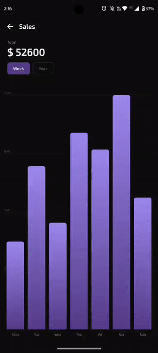
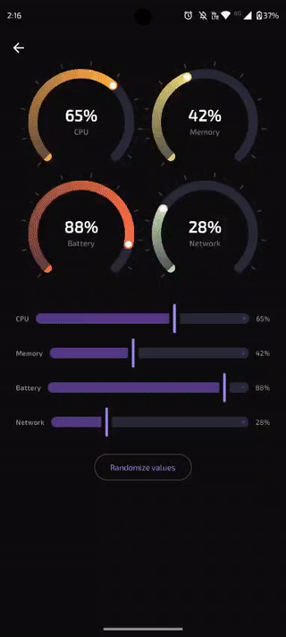
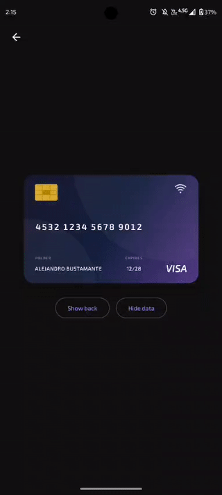

# Jetpack Compose Components

A portfolio of custom Android UI components built with Jetpack Compose, focused on animations, gestures, and polished interactions.

## Preview

<table>
  <tr>
    <td align="center"><br/><sub>Loading Button</sub></td>
    <td align="center"><br/><sub>Bar Chart</sub></td>
    <td align="center"><br/><sub>Circular Gauge</sub></td>
    <td align="center"><br/><sub>Expandable FAB</sub></td>
  </tr>
  <tr>
    <td align="center"><br/><sub>Credit Card</sub></td>
    <td align="center"><br/><sub>Onboarding Pager</sub></td>
    <td align="center"><br/><sub>Travel Card</sub></td>
    <td align="center"><br/><sub>Stories Progress</sub></td>
  </tr>
  <tr>
    <td align="center"><br/><sub>Wallet Stack</sub></td>
  </tr>
</table>

## Components

### Credit Card
3D flip animation between front and back faces. Features a Canvas-drawn chip and contactless icon, gradient backgrounds, and a toggle to mask sensitive data (card number, holder name, expiry, CVV).

### Expandable FAB
A floating action button that expands into a set of labeled mini-actions. Each item animates in with a staggered alpha and slide, the main icon rotates on open, and a scrim overlay closes everything on tap.

### Circular Gauge
A 270-degree arc gauge drawn entirely on Canvas. Displays an animated count-up value, tick marks, a sweep gradient, and color interpolation from cyan to amber to red based on the current value.

### Bar Chart
Animated bar chart with staggered entry per bar, top-rounded corners via `Path`, subtle grid lines, and tap-to-select with a tooltip showing the exact value. Supports switching between weekly and yearly datasets.

### Loading Button
A button that morphs from a full-width rectangle to a circle on tap. Goes through idle -> loading (animated spinner with variable sweep) -> success / error states, with distinct `AnimatedContent` transitions per step and press-scale feedback.

### Onboarding Pager
A minimalist onboarding flow built with `HorizontalPager`. Each page animates its title and subtitle in with a fade + slide-up on entry. The page indicators morph between dot and pill with a spring animation, and the primary button crossfades between "Next" and "Get Started" on the last page. The skip button fades out when there is nothing left to skip.

### Stories Progress Bar
A full-screen stories viewer inspired by Instagram Stories. Five Japan travel photos cycle automatically with a segmented progress bar at the top. Tap the right half to advance, tap the left half to go back, and hold to pause the timer. All images are preloaded on entry via Coil to eliminate blank frames between transitions. The crossfade prevents hard cuts between stories.

### Travel Card
A travel destination card inspired by Airbnb-style UIs. Tapping the card triggers a `SharedTransitionLayout` hero animation where the image transitions to a full-screen detail view. The detail content slides up from the bottom via `AnimatedVisibility` with `slideInVertically`, creating a bottom sheet feel. Includes a save toggle, rating display, amenity chips, and a Book Now CTA.

### PIN / OTP Entry
A 6-digit PIN entry screen with a custom numeric keypad. Each digit box animates in with a spring scale-up on press and a bounce-back on delete. On submission, the screen enters a loading state, then transitions to success (boxes turn green with a checkmark icon) or error (boxes turn red + horizontal shake animation). After an error, the input resets automatically and returns to idle.

### Music Player
A compact Spotify-style music player card. A vinyl disc rotates infinitely while playing and pauses in place on stop, driven by an `Animatable` loop that cancels automatically on state change. The card background transitions between track accent colors via `animateColorAsState`, and a large radial gradient glow behind the card shifts color per track. The seek bar is drawn on `Canvas` inside `BoxWithConstraints` and handles both tap-to-seek and drag-to-seek via raw pointer events (`awaitEachGesture`). Play/pause uses `AnimatedContent` with a scale+fade transition between icons. Track dots below the card animate between circle and pill with a spring. A `rememberUpdatedState` fix ensures the play/pause button always dispatches to the current state rather than a stale captured lambda.

### Wallet Stack
A wallet UI showing a stack of payment cards that collapses into a layered fan and expands on tap. Each card reuses the `CardFront` composable from the Credit Card component, keeping chip, contactless icon, network logo, and gradient design consistent. Card Y position and scale animate with a `spring` using `DampingRatioMediumBouncy`, creating a natural bouncy spread. Selecting an expanded card brings it to the top of the stack with the same spring animation. The active card's balance and bank name update via an `AnimatedContent` crossfade. `BackHandler` intercepts the system back gesture while expanded to collapse the stack instead of navigating away.

## Tech Stack

- **Language:** Kotlin
- **UI:** Jetpack Compose + Material 3
- **Navigation:** Navigation Compose 2.8.9
- **Animations:** `animateFloatAsState`, `animateDpAsState`, `animateColorAsState`, `AnimatedContent`, `AnimatedVisibility`, `SharedTransitionLayout`, `Animatable`, `rememberInfiniteTransition`, `rememberUpdatedState`, `HorizontalPager`
- **Image loading:** Coil 3 (`AsyncImage`, preload, crossfade)
- **Drawing:** Compose `Canvas`, `Path`, `DrawScope`
- **Min SDK:** 24

## Project Structure

```
app/src/main/java/com/gamman/jetpackcomposecomponents/
├── navigation/
│   ├── Screen.kt           # Sealed class with all routes
│   └── AppNavigation.kt    # NavHost setup
├── ui/
│   ├── components/
│   │   ├── creditcard/
│   │   ├── expandablefab/
│   │   ├── circulargauge/
│   │   ├── barchart/
│   │   ├── loadingbutton/
│   │   ├── onboardingpager/
│   │   ├── storiesprogress/
│   │   ├── travelcard/
│   │   ├── pinotp/
│   │   ├── musicplayer/
│   │   └── walletstack/
│   └── screens/            # One screen wrapper per component
└── MainActivity.kt
```

## Adding a New Component

1. Create `ui/components/<name>/YourComponent.kt`
2. Create `ui/screens/YourScreen.kt`
3. Add a `data object` to `navigation/Screen.kt`
4. Register a `composable {}` block in `AppNavigation.kt`
5. Add a `ComponentEntry` to the catalog in `HomeScreen.kt`